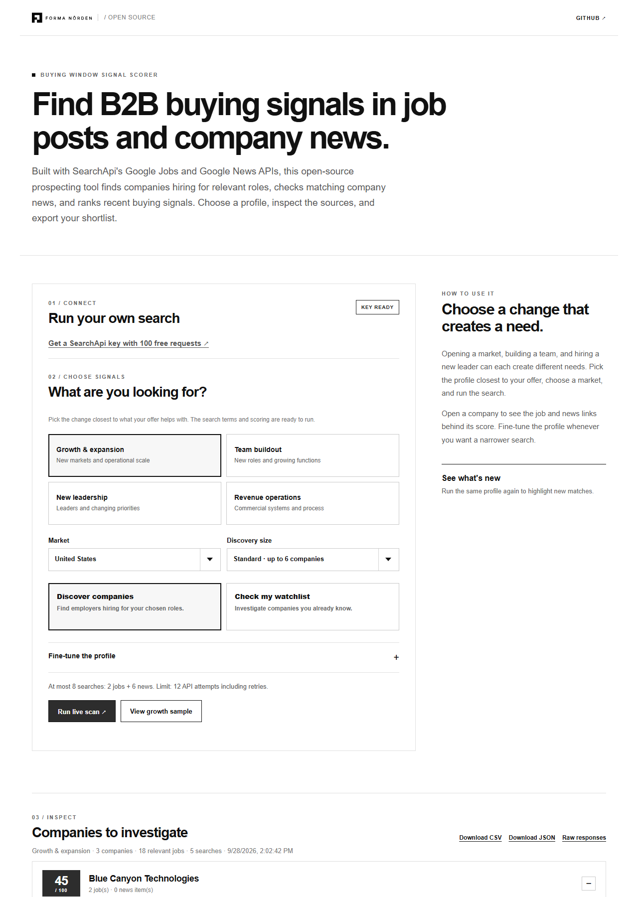

# Buying Window Signal Scorer

**Find companies showing the changes your offer can help with.** Built with SearchApi's [Google Jobs](https://www.searchapi.io/docs/google-jobs?utm_source=dev&utm_medium=ambassador&utm_campaign=formanorden.com) and [Google News](https://www.searchapi.io/docs/google-news?utm_source=dev&utm_medium=ambassador&utm_campaign=formanorden.com) APIs, this small, open-source app turns hiring and company news into a source-linked research queue. You choose the signals; the scorer shows why each company appeared and how it earned its score.

It is useful for consultants, agencies, software teams, recruiters, and founders researching B2B prospects. The default looks for growth and expansion; you can switch to team buildout, new leadership, revenue operations, or your own profile.



## Get started

**Prerequisites:** Python 3.11+ and a [SearchApi account](https://www.searchapi.io/?utm_source=dev&utm_medium=ambassador&utm_campaign=formanorden.com). SearchApi currently offers **100 free requests** when you sign up; [check its pricing page](https://www.searchapi.io/pricing?utm_source=dev&utm_medium=ambassador&utm_campaign=formanorden.com) for the current allowance.

```bash
git clone https://github.com/forma-norden/buying-window-signal-scorer.git
cd buying-window-signal-scorer
python -m venv .venv
```

Activate the environment and install the app:

```bash
# macOS / Linux
source .venv/bin/activate

# Windows PowerShell
.venv\Scripts\Activate.ps1

python -m pip install -e .
```

Copy `.env.example` to `.env` in the project folder and set `SEARCHAPI_API_KEY=your_key`. The `.env` file is ignored by Git. You can also set that environment variable in your shell. Then start the app:

```bash
python -m buying_window.cli serve
```

Open **http://127.0.0.1:8765**, choose a profile and market, review the request estimate, and select **Run live scan**.

Want to see the interface first? **View growth sample** loads a fictional fixture without an API key or API requests.

## Start with a question you can act on

| Your offer | Profile to try | What to adapt |
| --- | --- | --- |
| Logistics or process software | Growth & expansion | Operations roles, warehouse or market-opening language, expansion news |
| Recruiting or training | Hiring & team buildout | Roles you can fill or train, first-team-hire language |
| Strategy or implementation services | New leadership | Executive roles and appointment news relevant to your market |
| CRM or sales systems | Revenue operations | RevOps roles, systems mandates and commercial leadership news |

These are starting points. Edit job searches, title matches, description phrases, news events, score weights, market, and request limit in the dashboard. A profile should express **why a company might need your specific offer now**, not merely whether it is a large or familiar company.

Choose **Discover companies** to search Jobs for relevant roles and then check company news for the employers found. Choose **Check my watchlist** to paste companies you already know, one per line. Add aliases as `Company | alias one, alias two` when the same employer appears under more than one name.

## Read the score, then open the sources

Each company receives up to **100 points**, from the selected profile's rules:

| Evidence | Default points | What qualifies |
| --- | ---: | --- |
| Job-title and description match | 40 | A strong or adjacent title, with extra weight for a matching mandate in the description |
| Job recency | 20 | A matching listing dated within 30 days; the newest week earns more |
| Company news | 25 | A matching event dated within 30 days and tied to a sufficiently specific company name |
| Both signals | 15 | A qualifying job and news event appear together |

Open a result to see the exact listing, article, date, matched phrase, score components, and any review flags. An undated item is visible but earns no recency points. News with a weak company match is visible but earns no news points. The score is a **research priority for your chosen profile**; it cannot establish a purchase decision or whether the company fits your market.

The app shows a request estimate before a live run and enforces your attempt cap, including retries. A default discovery scan uses at most eight initial searches: two Jobs queries and news checks for up to six companies. Results can be downloaded as CSV or JSON, with redacted raw responses archived locally for inspection.

Run the same settings again to mark listings and articles **first seen in your scan results**. That label does not claim the item was first posted that day. Re-score a saved raw archive without another API call:

```bash
python -m buying_window.cli replay data/raw/<archive-name>.json
```

## Where this fits

This app helps **find and inspect** possible buying windows. Use Forma Nôrden's [Signal-Based List Building Workflow](https://github.com/forma-norden/signal-based-list-building-workflow) to develop the wider source list and the [Buying Window Signal Workflow](https://github.com/forma-norden/buying-window-signal-workflow) to decide who owns a verified signal and what happens next. The scorer stays deliberately small: one local dashboard, two SearchApi engines, editable rules, and exportable evidence.

## Develop and verify

```bash
python -m unittest discover -s tests -v
```

The core matching and scoring rules are in `buying_window/core.py`; search planning is in `runner.py`; the local API and dashboard are in `webapp.py` and `web/`. `examples/demo-responses.json` contains fictional sample data. [The dated run note](docs/live-run-2026-09-28.md) records a bounded live check separately from this getting-started guide. [Publication drafts](publication/README.md) are also in the repository.

Google Jobs may attribute a listing to a recruiter, and a short company name may match unrelated news. Confirm the employer and read the source before outreach. SearchApi provided API credits for this project; Forma Nôrden built the app and its scoring rules. Released under the [MIT licence](LICENSE).
